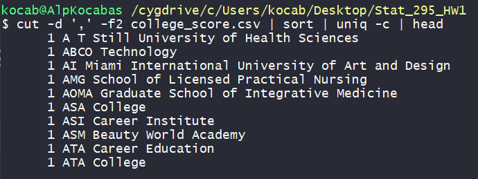

# Question 1

Codes for Linux

-   **To work on a file.**

    ```{r}
    #cd C:/Users/kocab/Desktop/Stat_295_HW1

    ```

-   **To read the data.**

    ```{r}
    #wget --content-disposition https://raw.githubusercontent.com/dhavalpotdar/College-Scorecard-Data-Analysis/master/MERGED_2017_2018_cleaned.csv
    ```

-   **To change the name of data set.**

    ```{r}
    #mv MERGED_2017_2018_cleaned.csv college_score.csv
    ```

-   **To print the lines 10 through 60.**

    ```{r}
    #head -n 60 college_score.csv | tail -n 51
    ```

-   **To create sub-sample of data set with appropriate conditions.**

    ```{r}
    #grep "Public" college_score.csv | grep ",Montgomery," > subsample.csv
    ```

-   **To obtain the frequencies of each cities.**

    ```{r}
    #cut -d ',' -f2 college_score.csv | sort | uniq -c
    ```

## Outputs for 1

-   **The lines 10 through 60.**

    {width="650"}

-   **Head of obtained frequencies of each cities.**

    {width="590"}

# Question 2

# Question 3

# Question 4
